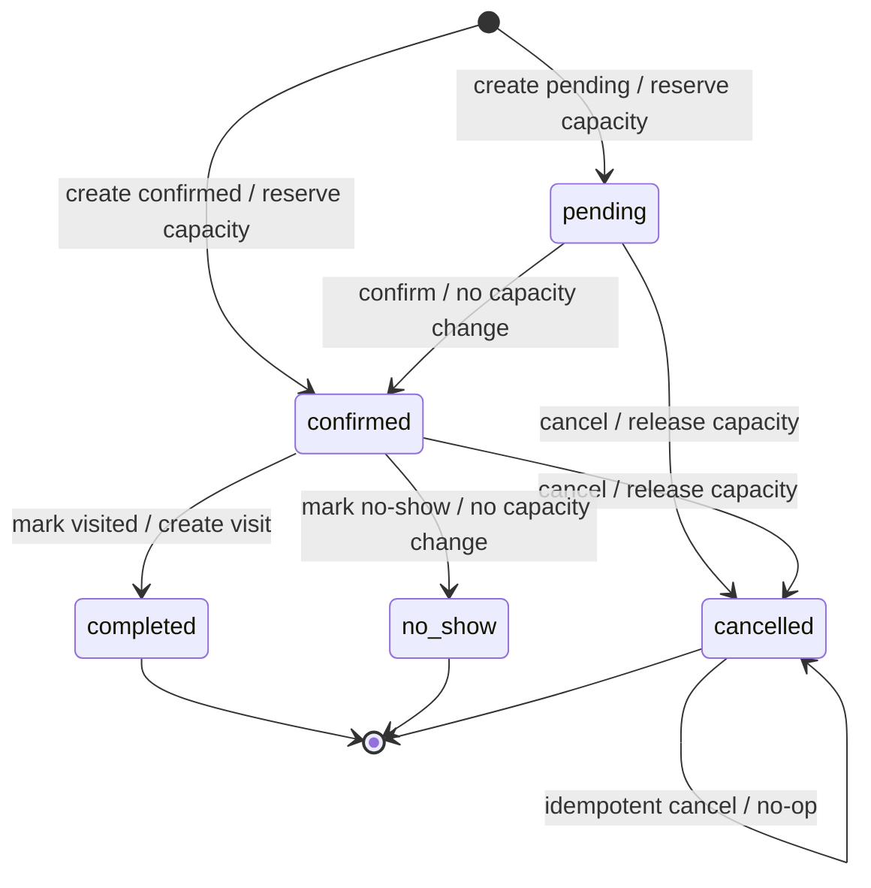

# 101A. 予約システム: Data Model

## 既存DB再利用方針

### users

`customers` テーブルは新設しない。既存 `users` を顧客統合IDとして使う。

理由:

- `users` はメール、電話、外部ID、表示名を持つ。
- `friends.user_id` でLINE友だちと内部UUIDを結べる。
- じゃらん、電話、Gmail、LINEを同じ人物として統合しやすい。

ただし、予約固有の状態を `users` に直接増やしすぎると汎用IDテーブルが肥大化する。予約ドメイン固有の情報は `reservation_customer_profiles` に持つ。

### friends

LINE上の顧客接点は既存 `friends` を使う。

MVPでは `friends.line_user_id` から `friend_id` を解決し、`friends.user_id` で `users.id` と結ぶ。将来、複数LINE公式アカウントで同じLINE userIdを扱う必要が強くなった場合は、`friends` に `line_account_id` を追加して `UNIQUE(line_account_id, line_user_id)` へ移行する。

### line_accounts

`line_accounts` はLINE公式アカウントの接続設定である。顧客接点として再利用しない。

`line_accounts` に予約者情報やLINE userIdを入れると、公式アカウント設定と顧客データが混ざる。これは保守性が悪く、マルチアカウント運用時に破綻する。

## 推奨DB設計

### reservation_customer_profiles

予約ドメイン固有の顧客状態。

```sql
CREATE TABLE IF NOT EXISTS reservation_customer_profiles (
  user_id TEXT PRIMARY KEY REFERENCES users (id) ON DELETE CASCADE,
  status TEXT NOT NULL DEFAULT 'prospect'
    CHECK (status IN ('prospect', 'reserved', 'visited', 'cancelled', 'inactive')),
  source TEXT NOT NULL DEFAULT 'line'
    CHECK (source IN ('line', 'jalan', 'phone', 'gmail', 'admin', 'mcp', 'unknown')),
  memo TEXT,
  metadata TEXT NOT NULL DEFAULT '{}',
  first_reserved_at TEXT,
  last_reserved_at TEXT,
  first_visited_at TEXT,
  last_visited_at TEXT,
  created_at TEXT NOT NULL DEFAULT (strftime('%Y-%m-%dT%H:%M:%f', 'now', '+9 hours')),
  updated_at TEXT NOT NULL DEFAULT (strftime('%Y-%m-%dT%H:%M:%f', 'now', '+9 hours'))
);
```

### reservation_resources

予約対象。大きなカテゴリ。

```sql
CREATE TABLE IF NOT EXISTS reservation_resources (
  id TEXT PRIMARY KEY,
  line_account_id TEXT REFERENCES line_accounts (id) ON DELETE SET NULL,
  name TEXT NOT NULL,
  description TEXT,
  default_duration_minutes INTEGER NOT NULL DEFAULT 60,
  default_capacity INTEGER NOT NULL DEFAULT 1,
  default_line_capacity INTEGER,
  default_external_capacity INTEGER,
  default_buffer_capacity INTEGER NOT NULL DEFAULT 0,
  slot_interval_minutes INTEGER NOT NULL DEFAULT 60,
  timezone TEXT NOT NULL DEFAULT 'Asia/Tokyo',
  is_active INTEGER NOT NULL DEFAULT 1,
  display_order INTEGER NOT NULL DEFAULT 0,
  metadata TEXT NOT NULL DEFAULT '{}',
  created_at TEXT NOT NULL DEFAULT (strftime('%Y-%m-%dT%H:%M:%f', 'now', '+9 hours')),
  updated_at TEXT NOT NULL DEFAULT (strftime('%Y-%m-%dT%H:%M:%f', 'now', '+9 hours'))
);
```

### reservation_menus

予約フォームで選ぶメニュー/プラン。

#### 年齢区分 Phase 1: 既存Resource互換

既存Resourceは、従来の3区分に `3歳以下` を追加して扱う。

```text
adult_count        = 大人
child_count        = 小学生
infant_count       = 幼児
under_three_count  = 3歳以下
```

Menuは `price_under_three` と `capacity_count_under_three` を持つ。`capacity_count_under_three=0` なら、3歳以下は人数には含めるが予約枠は消費しない。

```text
total_people =
  adult_count + child_count + infant_count + under_three_count

capacity_people =
  adult_count * capacity_count_adult
+ child_count * capacity_count_child
+ infant_count * capacity_count_infant
+ under_three_count * capacity_count_under_three
```

キャンセル時の在庫戻しは、Menu設定を再計算せず、予約作成時に保存した `reservations.capacity_people` だけを戻す。これにより、Menuの枠消費設定を後から変更しても過去予約の戻し量は壊れない。

#### 年齢区分 Phase 2: 新規Resource向けの柔軟カテゴリ

今後作るResourceでは、固定カラム追加を避けるため、年齢区分を設定テーブル化する。

```sql
CREATE TABLE reservation_people_categories (
  id TEXT PRIMARY KEY,
  resource_id TEXT NOT NULL REFERENCES reservation_resources(id) ON DELETE CASCADE,
  code TEXT NOT NULL,
  label TEXT NOT NULL,
  display_order INTEGER NOT NULL DEFAULT 0,
  default_price INTEGER,
  counts_capacity INTEGER NOT NULL DEFAULT 1,
  is_active INTEGER NOT NULL DEFAULT 1,
  metadata TEXT NOT NULL DEFAULT '{}',
  UNIQUE(resource_id, code)
);

CREATE TABLE reservation_menu_people_categories (
  id TEXT PRIMARY KEY,
  menu_id TEXT NOT NULL REFERENCES reservation_menus(id) ON DELETE CASCADE,
  category_id TEXT NOT NULL REFERENCES reservation_people_categories(id) ON DELETE CASCADE,
  price INTEGER,
  counts_capacity INTEGER,
  is_enabled INTEGER NOT NULL DEFAULT 1,
  display_order INTEGER NOT NULL DEFAULT 0,
  UNIQUE(menu_id, category_id)
);

CREATE TABLE reservation_people_breakdowns (
  id TEXT PRIMARY KEY,
  reservation_id TEXT NOT NULL REFERENCES reservations(id) ON DELETE CASCADE,
  category_code TEXT NOT NULL,
  label_snapshot TEXT NOT NULL,
  count INTEGER NOT NULL DEFAULT 0 CHECK (count >= 0),
  unit_price INTEGER,
  amount INTEGER,
  counts_capacity INTEGER NOT NULL DEFAULT 1,
  capacity_people INTEGER NOT NULL DEFAULT 0,
  metadata TEXT NOT NULL DEFAULT '{}',
  UNIQUE(reservation_id, category_code)
);
```

Phase 2でも旧4カラムは互換用に残す。新UI/APIは `reservation_people_breakdowns` を優先し、未作成の古い予約だけ旧カラムから表示する。

```sql
CREATE TABLE IF NOT EXISTS reservation_menus (
  id TEXT PRIMARY KEY,
  resource_id TEXT NOT NULL REFERENCES reservation_resources (id) ON DELETE CASCADE,
  name TEXT NOT NULL,
  description TEXT,
  duration_minutes INTEGER NOT NULL DEFAULT 60,
  unit_type TEXT NOT NULL DEFAULT 'person'
    CHECK (unit_type IN ('person', 'group', 'seat', 'table')),
  min_people INTEGER NOT NULL DEFAULT 1,
  max_people INTEGER,
  price_adult INTEGER,
  price_child INTEGER,
  price_infant INTEGER,
  capacity_count_adult INTEGER NOT NULL DEFAULT 1 CHECK (capacity_count_adult IN (0, 1)),
  capacity_count_child INTEGER NOT NULL DEFAULT 1 CHECK (capacity_count_child IN (0, 1)),
  capacity_count_infant INTEGER NOT NULL DEFAULT 1 CHECK (capacity_count_infant IN (0, 1)),
  form_fields TEXT NOT NULL DEFAULT '[]',
  is_active INTEGER NOT NULL DEFAULT 1,
  display_order INTEGER NOT NULL DEFAULT 0,
  metadata TEXT NOT NULL DEFAULT '{}',
  created_at TEXT NOT NULL DEFAULT (strftime('%Y-%m-%dT%H:%M:%f', 'now', '+9 hours')),
  updated_at TEXT NOT NULL DEFAULT (strftime('%Y-%m-%dT%H:%M:%f', 'now', '+9 hours'))
);
```

### reservation_schedules

曜日ごとの基本受付時間。

```sql
CREATE TABLE IF NOT EXISTS reservation_schedules (
  id TEXT PRIMARY KEY,
  resource_id TEXT NOT NULL REFERENCES reservation_resources (id) ON DELETE CASCADE,
  day_of_week INTEGER NOT NULL CHECK (day_of_week BETWEEN 0 AND 6),
  start_time TEXT NOT NULL,
  end_time TEXT NOT NULL,
  slot_interval_minutes INTEGER NOT NULL DEFAULT 60,
  default_capacity INTEGER NOT NULL DEFAULT 1,
  default_line_capacity INTEGER,
  default_external_capacity INTEGER,
  default_buffer_capacity INTEGER NOT NULL DEFAULT 0,
  is_active INTEGER NOT NULL DEFAULT 1,
  created_at TEXT NOT NULL DEFAULT (strftime('%Y-%m-%dT%H:%M:%f', 'now', '+9 hours')),
  updated_at TEXT NOT NULL DEFAULT (strftime('%Y-%m-%dT%H:%M:%f', 'now', '+9 hours'))
);
```

9:00-15:00の場合、`start_time = '09:00'`, `end_time = '15:00'` とする。生成される枠は `09:00-10:00` から `14:00-15:00` の6枠。

### reservation_slots

日付ごとの実在予約枠。

```sql
CREATE TABLE IF NOT EXISTS reservation_slots (
  id TEXT PRIMARY KEY,
  resource_id TEXT NOT NULL REFERENCES reservation_resources (id) ON DELETE CASCADE,
  date TEXT NOT NULL,
  start_at TEXT NOT NULL,
  end_at TEXT NOT NULL,
  total_capacity INTEGER NOT NULL CHECK (total_capacity >= 0),
  line_capacity INTEGER CHECK (line_capacity IS NULL OR line_capacity >= 0),
  external_capacity INTEGER CHECK (external_capacity IS NULL OR external_capacity >= 0),
  buffer_capacity INTEGER NOT NULL DEFAULT 0 CHECK (buffer_capacity >= 0),
  reserved_count INTEGER NOT NULL DEFAULT 0 CHECK (reserved_count >= 0),
  line_reserved_count INTEGER NOT NULL DEFAULT 0 CHECK (line_reserved_count >= 0),
  external_reserved_count INTEGER NOT NULL DEFAULT 0 CHECK (external_reserved_count >= 0),
  status TEXT NOT NULL DEFAULT 'open'
    CHECK (status IN ('open', 'closed', 'sold_out', 'hidden')),
  note TEXT,
  created_at TEXT NOT NULL DEFAULT (strftime('%Y-%m-%dT%H:%M:%f', 'now', '+9 hours')),
  updated_at TEXT NOT NULL DEFAULT (strftime('%Y-%m-%dT%H:%M:%f', 'now', '+9 hours')),
  UNIQUE(resource_id, start_at, end_at)
);
```

`sold_out` はMVPでは自動管理しない。`status = 'open'` でも `remaining_capacity <= 0` なら満席扱いにする。

予約が1件でも存在する slot は削除禁止。削除ではなく `status = 'closed'` または `hidden` にする。

### reservation_blackouts

全体または特定予約対象の予約不可時間。

```sql
CREATE TABLE IF NOT EXISTS reservation_blackouts (
  id TEXT PRIMARY KEY,
  resource_id TEXT REFERENCES reservation_resources (id) ON DELETE CASCADE,
  start_at TEXT NOT NULL,
  end_at TEXT NOT NULL,
  reason TEXT,
  created_at TEXT NOT NULL DEFAULT (strftime('%Y-%m-%dT%H:%M:%f', 'now', '+9 hours'))
);
```

### reservations

予約ヘッダー。

```sql
CREATE TABLE IF NOT EXISTS reservations (
  id TEXT PRIMARY KEY,
  line_account_id TEXT REFERENCES line_accounts (id) ON DELETE SET NULL,
  user_id TEXT REFERENCES users (id) ON DELETE SET NULL,
  friend_id TEXT REFERENCES friends (id) ON DELETE SET NULL,
  slot_id TEXT NOT NULL REFERENCES reservation_slots (id) ON DELETE RESTRICT,
  source TEXT NOT NULL DEFAULT 'line'
    CHECK (source IN ('line', 'jalan', 'phone', 'gmail', 'admin', 'mcp')),
  capacity_channel TEXT NOT NULL DEFAULT 'line'
    CHECK (capacity_channel IN ('line', 'external', 'manual')),
  external_reservation_id TEXT,
  dedupe_key TEXT,
  title TEXT NOT NULL,
  reservation_date TEXT NOT NULL,
  start_at TEXT NOT NULL,
  end_at TEXT NOT NULL,
  status TEXT NOT NULL DEFAULT 'confirmed'
    CHECK (status IN ('pending', 'confirmed', 'cancelled', 'completed', 'no_show')),
  adult_count INTEGER NOT NULL DEFAULT 0 CHECK (adult_count >= 0),
  child_count INTEGER NOT NULL DEFAULT 0 CHECK (child_count >= 0),
  infant_count INTEGER NOT NULL DEFAULT 0 CHECK (infant_count >= 0),
  total_people INTEGER NOT NULL DEFAULT 1 CHECK (total_people > 0),
  capacity_people INTEGER NOT NULL DEFAULT 1 CHECK (capacity_people > 0),
  customer_name_snapshot TEXT,
  customer_phone_snapshot TEXT,
  customer_email_snapshot TEXT,
  cancel_reason TEXT,
  form_data TEXT NOT NULL DEFAULT '{}',
  metadata TEXT NOT NULL DEFAULT '{}',
  created_at TEXT NOT NULL DEFAULT (strftime('%Y-%m-%dT%H:%M:%f', 'now', '+9 hours')),
  updated_at TEXT NOT NULL DEFAULT (strftime('%Y-%m-%dT%H:%M:%f', 'now', '+9 hours'))
);
```

`external_reservation_id` と `dedupe_key` は `NULL` を許すが、外部取り込みではどちらかを必須にする。

空文字はDB helperで必ず `NULL` に正規化する。

```typescript
function nullableText(value?: string | null): string | null {
  const normalized = value?.trim();
  return normalized ? normalized : null;
}
```

外部IDの一意性は、テーブル内 `UNIQUE` ではなく部分ユニークインデックスで表す。SQLite/D1では `NULL` は重複扱いされないが、空文字混入を避けるためにも意図を明確にする。

### reservation_items

予約メニュー明細。

```sql
CREATE TABLE IF NOT EXISTS reservation_items (
  id TEXT PRIMARY KEY,
  reservation_id TEXT NOT NULL REFERENCES reservations (id) ON DELETE CASCADE,
  menu_id TEXT REFERENCES reservation_menus (id) ON DELETE SET NULL,
  resource_id TEXT REFERENCES reservation_resources (id) ON DELETE SET NULL,
  name_snapshot TEXT NOT NULL,
  quantity INTEGER NOT NULL DEFAULT 1,
  adult_count INTEGER NOT NULL DEFAULT 0,
  child_count INTEGER NOT NULL DEFAULT 0,
  infant_count INTEGER NOT NULL DEFAULT 0,
  capacity_people INTEGER NOT NULL DEFAULT 1,
  unit_price INTEGER,
  amount INTEGER,
  metadata TEXT NOT NULL DEFAULT '{}',
  created_at TEXT NOT NULL DEFAULT (strftime('%Y-%m-%dT%H:%M:%f', 'now', '+9 hours'))
);
```

### reservation_events

予約変更ログ。

```sql
CREATE TABLE IF NOT EXISTS reservation_events (
  id TEXT PRIMARY KEY,
  reservation_id TEXT NOT NULL REFERENCES reservations (id) ON DELETE CASCADE,
  event_type TEXT NOT NULL
    CHECK (event_type IN ('created', 'updated', 'confirmed', 'cancelled', 'completed', 'no_show', 'sync_failed', 'imported')),
  actor_type TEXT NOT NULL DEFAULT 'system'
    CHECK (actor_type IN ('customer', 'admin', 'gas', 'mcp', 'system')),
  actor_id TEXT,
  before_payload TEXT,
  after_payload TEXT,
  created_at TEXT NOT NULL DEFAULT (strftime('%Y-%m-%dT%H:%M:%f', 'now', '+9 hours'))
);
```

### visits

来園履歴。

```sql
CREATE TABLE IF NOT EXISTS visits (
  id TEXT PRIMARY KEY,
  user_id TEXT REFERENCES users (id) ON DELETE SET NULL,
  reservation_id TEXT REFERENCES reservations (id) ON DELETE SET NULL,
  visited_at TEXT NOT NULL,
  party_size INTEGER,
  spend_amount INTEGER,
  memo TEXT,
  metadata TEXT NOT NULL DEFAULT '{}',
  created_at TEXT NOT NULL DEFAULT (strftime('%Y-%m-%dT%H:%M:%f', 'now', '+9 hours')),
  UNIQUE(reservation_id)
);
```

### external_reservation_sources

Gmail/じゃらん/外部予約取り込み。

```sql
CREATE TABLE IF NOT EXISTS external_reservation_sources (
  id TEXT PRIMARY KEY,
  source TEXT NOT NULL CHECK (source IN ('jalan', 'gmail', 'phone', 'manual')),
  event_type TEXT NOT NULL DEFAULT 'unknown'
    CHECK (event_type IN ('created', 'updated', 'cancelled', 'unknown')),
  external_id TEXT,
  dedupe_key TEXT,
  reservation_id TEXT REFERENCES reservations (id) ON DELETE SET NULL,
  raw_text TEXT,
  parsed_payload TEXT NOT NULL DEFAULT '{}',
  parse_status TEXT NOT NULL DEFAULT 'pending'
    CHECK (parse_status IN ('pending', 'parsed', 'imported', 'needs_review', 'failed', 'duplicate', 'ignored')),
  received_at TEXT,
  last_error TEXT,
  created_at TEXT NOT NULL DEFAULT (strftime('%Y-%m-%dT%H:%M:%f', 'now', '+9 hours')),
  updated_at TEXT NOT NULL DEFAULT (strftime('%Y-%m-%dT%H:%M:%f', 'now', '+9 hours'))
);
```

同じ `source + external_id` または `source + dedupe_key` の再取り込みは、既存 `reservation_id` を返す idempotent success とする。

`external_id` または `dedupe_key` が空文字の場合は `NULL` として保存する。外部取り込みでは、どちらも `NULL` の状態を拒否する。

`event_type = 'cancelled'` の場合は、新規予約を作らず、既存予約を検索して状態遷移表に従い `cancelled` に更新する。

### external_sync_tasks

LINE予約をじゃらん側に手動/半自動反映するタスク。

```sql
CREATE TABLE IF NOT EXISTS external_sync_tasks (
  id TEXT PRIMARY KEY,
  reservation_id TEXT REFERENCES reservations (id) ON DELETE CASCADE,
  slot_id TEXT REFERENCES reservation_slots (id) ON DELETE SET NULL,
  provider TEXT NOT NULL CHECK (provider IN ('jalan', 'google_calendar')),
  task_type TEXT NOT NULL CHECK (task_type IN ('reduce_capacity', 'restore_capacity', 'create_event', 'cancel_event', 'review')),
  adjustment_count INTEGER,
  status TEXT NOT NULL DEFAULT 'pending'
    CHECK (status IN ('pending', 'done', 'failed', 'skipped')),
  note TEXT,
  last_error TEXT,
  created_at TEXT NOT NULL DEFAULT (strftime('%Y-%m-%dT%H:%M:%f', 'now', '+9 hours')),
  completed_at TEXT
);
```

## 推奨インデックス

```sql
CREATE INDEX IF NOT EXISTS idx_reservation_profiles_status ON reservation_customer_profiles (status);
CREATE INDEX IF NOT EXISTS idx_reservation_resources_account ON reservation_resources (line_account_id);
CREATE INDEX IF NOT EXISTS idx_reservation_menus_resource ON reservation_menus (resource_id, is_active, display_order);
CREATE INDEX IF NOT EXISTS idx_reservation_schedules_resource ON reservation_schedules (resource_id, day_of_week);
CREATE INDEX IF NOT EXISTS idx_reservation_slots_resource_date ON reservation_slots (resource_id, date, start_at);
CREATE INDEX IF NOT EXISTS idx_reservation_slots_status ON reservation_slots (status);
CREATE INDEX IF NOT EXISTS idx_reservations_date ON reservations (reservation_date, status);
CREATE INDEX IF NOT EXISTS idx_reservations_user ON reservations (user_id);
CREATE INDEX IF NOT EXISTS idx_reservations_slot ON reservations (slot_id, status);
CREATE INDEX IF NOT EXISTS idx_reservations_source_external ON reservations (source, external_reservation_id);
CREATE INDEX IF NOT EXISTS idx_reservations_source_dedupe ON reservations (source, dedupe_key);
CREATE UNIQUE INDEX IF NOT EXISTS uniq_reservations_external_id
  ON reservations (source, external_reservation_id)
  WHERE external_reservation_id IS NOT NULL;
CREATE UNIQUE INDEX IF NOT EXISTS uniq_reservations_dedupe_key
  ON reservations (source, dedupe_key)
  WHERE dedupe_key IS NOT NULL;
CREATE INDEX IF NOT EXISTS idx_reservation_events_reservation ON reservation_events (reservation_id, created_at);
CREATE INDEX IF NOT EXISTS idx_external_sources_external ON external_reservation_sources (source, external_id);
CREATE INDEX IF NOT EXISTS idx_external_sources_dedupe ON external_reservation_sources (source, dedupe_key);
CREATE UNIQUE INDEX IF NOT EXISTS uniq_external_sources_external_id
  ON external_reservation_sources (source, external_id)
  WHERE external_id IS NOT NULL;
CREATE UNIQUE INDEX IF NOT EXISTS uniq_external_sources_dedupe_key
  ON external_reservation_sources (source, dedupe_key)
  WHERE dedupe_key IS NOT NULL;
CREATE INDEX IF NOT EXISTS idx_external_sync_tasks_status ON external_sync_tasks (provider, status, created_at);
```

## 在庫カウンタと予約元の分離

`source` は予約の発生元を表す。`line`, `jalan`, `phone`, `gmail`, `admin`, `mcp` を取り得る。

`source` は在庫カウンタの種類を表さない。管理者予約やMCP予約でも、LINE枠を消費する場合と外部枠を消費する場合がある。

そのため `reservations.capacity_channel` を持つ。

| capacity_channel | 役割 |
|---|---|
| `line` | `line_reserved_count` を増減する |
| `external` | `external_reserved_count` を増減する |
| `manual` | `reserved_count` のみ増減する |

例:

| source | capacity_channel | 意味 |
|---|---|---|
| `line` | `line` | 通常のLINE予約 |
| `jalan` | `external` | じゃらん予約 |
| `gmail` | `external` | Gmail経由の外部予約 |
| `admin` | `line` | 管理者がLINE枠として代行入力 |
| `admin` | `external` | 管理者が外部枠として代行入力 |
| `mcp` | `line` | AI経由でLINE枠に予約作成 |

キャンセル時の在庫戻しは `source` ではなく `capacity_channel` に基づいて行う。

`capacity_channel = 'manual'` は、LINE枠・外部枠のどちらにも属さない共通予約として扱う。電話予約や現地受付などで、特定チャネル枠を消費させたくない場合に使う。ただし、LINE枠または外部枠を明示的に減らしたい管理者予約では `line` / `external` を指定する。

## 人数区分と在庫消費人数

予約人数は、表示・料金・在庫消費で役割が異なる。

MVPでは人数区分を以下の3つに分ける。

| カラム | 意味 |
|---|---|
| `adult_count` | 大人 |
| `child_count` | 子ども |
| `infant_count` | 幼児 |

`total_people` は来園する実人数の合計で、常に以下で計算する。

```text
total_people = adult_count + child_count + infant_count
```

一方、予約枠の残数を消費する人数は `capacity_people` として別に保存する。

```text
capacity_people =
  adult_count * menu.capacity_count_adult +
  child_count * menu.capacity_count_child +
  infant_count * menu.capacity_count_infant
```

`capacity_count_*` は `0` または `1` のフラグとする。

例:

| 運用 | adult | child | infant |
|---|---:|---:|---:|
| 大人・子ども・幼児すべて枠を消費する | 1 | 1 | 1 |
| 幼児だけ枠を消費しない | 1 | 1 | 0 |
| 大人だけ枠を消費する特殊運用 | 1 | 0 | 0 |

初期値は安全側に倒し、`adult=1`, `child=1`, `infant=1` とする。つまり幼児も予約枠を消費する。

キャンセル時の在庫戻しは `total_people` ではなく、予約作成時に保存した `reservations.capacity_people` を使う。これは、予約後にメニュー側の `capacity_count_*` 設定が変わっても、作成時に確保した在庫数だけを正しく戻すためである。

`capacity_people <= 0` になる予約は作成しない。幼児だけ予約を許可したい場合でも、在庫を消費しない予約が作られると残数・キャンセル処理・来園管理が壊れやすいため、MVPでは少なくとも1枠を消費する設計にする。

## 残数計算

MVPから `line_capacity` と `external_capacity` を使う。

```text
effective_total_capacity = total_capacity - buffer_capacity

total_remaining = effective_total_capacity - reserved_count

line_limit = COALESCE(line_capacity, effective_total_capacity)
line_remaining = MIN(total_remaining, line_limit - line_reserved_count)

external_limit = COALESCE(external_capacity, effective_total_capacity)
external_remaining = MIN(total_remaining, external_limit - external_reserved_count)
```

LINE予約画面では以下を満たす枠だけ選択可能にする。

```text
status = 'open'
AND line_remaining >= requested_capacity_people
AND total_remaining >= requested_capacity_people
```

じゃらん取り込みでは以下を満たす場合だけ通常取り込みにする。

```text
external_remaining >= requested_capacity_people
AND total_remaining >= requested_capacity_people
```

満たさない場合は、`external_reservation_sources.parse_status = 'needs_review'` として保存し、reservation は作らず、管理画面で要確認にする。じゃらん側で確定済み予約の場合でも、過剰予約を自動作成しない。

## 在庫確保

予約作成は、予約レコード作成より先に slot の在庫を条件付き `UPDATE` で確保する。

ここで使う `?` は `total_people` ではなく `capacity_people` とする。

`capacity_channel = 'line'`:

```sql
UPDATE reservation_slots
SET reserved_count = reserved_count + ?,
    line_reserved_count = line_reserved_count + ?,
    updated_at = strftime('%Y-%m-%dT%H:%M:%f', 'now', '+9 hours')
WHERE id = ?
  AND status = 'open'
  AND reserved_count + ? <= total_capacity - buffer_capacity
  AND line_reserved_count + ? <= COALESCE(line_capacity, total_capacity - buffer_capacity);
```

`capacity_channel = 'external'`:

```sql
UPDATE reservation_slots
SET reserved_count = reserved_count + ?,
    external_reserved_count = external_reserved_count + ?,
    updated_at = strftime('%Y-%m-%dT%H:%M:%f', 'now', '+9 hours')
WHERE id = ?
  AND status = 'open'
  AND reserved_count + ? <= total_capacity - buffer_capacity
  AND external_reserved_count + ? <= COALESCE(external_capacity, total_capacity - buffer_capacity);
```

`capacity_channel = 'manual'`:

```sql
UPDATE reservation_slots
SET reserved_count = reserved_count + ?,
    updated_at = strftime('%Y-%m-%dT%H:%M:%f', 'now', '+9 hours')
WHERE id = ?
  AND status = 'open'
  AND reserved_count + ? <= total_capacity - buffer_capacity;
```

更新件数が `1` の場合だけ予約作成へ進む。更新件数が `0` の場合は `409 slot_not_available` を返す。

予約作成、明細作成、イベント作成の途中で失敗した場合は、同じ処理内で slot の在庫を戻す compensating update を必ず行う。D1のbatch/transaction方針が決まったら、在庫確保から予約作成までを単一トランザクションへ寄せる。

## 在庫戻し

在庫を戻すのは、予約が占有状態から `cancelled` へ遷移した時だけ。

ここで戻す `?` は `reservations.capacity_people` とする。

```sql
UPDATE reservation_slots
SET reserved_count = MAX(reserved_count - ?, 0),
    line_reserved_count = CASE WHEN ? = 'line' THEN MAX(line_reserved_count - ?, 0) ELSE line_reserved_count END,
    external_reserved_count = CASE WHEN ? = 'external' THEN MAX(external_reserved_count - ?, 0) ELSE external_reserved_count END,
    updated_at = strftime('%Y-%m-%dT%H:%M:%f', 'now', '+9 hours')
WHERE id = ?;
```

実装では `MAX` だけに頼らず、状態遷移表に従って二重戻しを防ぐ。

LINE予約キャンセル時に、同じ予約に対する `external_sync_tasks.task_type = 'reduce_capacity'` かつ `status = 'done'` が存在する場合は、`restore_capacity` タスクを作成する。これにより、手動で減らしたじゃらん側の枠を戻す作業を漏らさない。

## 顧客ステータス再計算

`reservation_customer_profiles.status` は単一予約の状態で直接上書きしない。予約作成、キャンセル、来園済み、no-show、外部取り込み後に、`user_id` に紐づく予約全体と来園履歴から再計算する。

優先順位:

```text
今後の pending / confirmed 予約がある -> reserved
来園履歴がある -> visited
キャンセル履歴だけある -> cancelled
何もない -> prospect
```

実装では以下の関数に閉じ込める。

```typescript
recomputeReservationCustomerProfileStatus(userId)
```

同じユーザーが複数予約を持つ場合、1件だけキャンセルしても他に active 予約があれば `reserved` のままにする。

## MVPの制約

MVPでは予約は単一 slot のみを占有する。

制約:

- `menu.duration_minutes` は slot の duration と一致する必要がある。
- 複数 slot をまたぐ予約はMVP対象外。
- 複数 resource を同時消費するセット予約はMVP対象外。
- 摘み取り + カフェセットは、MVPでは1つの resource 内のメニューとして扱う。
- `start_at`, `end_at`, `reservation_date` はクライアントから受け取らず、サーバーが slot から確定する。

将来、複数 slot や複数 resource を扱う場合は `reservation_slot_holds` を追加する。

```sql
CREATE TABLE IF NOT EXISTS reservation_slot_holds (
  id TEXT PRIMARY KEY,
  reservation_id TEXT NOT NULL REFERENCES reservations (id) ON DELETE CASCADE,
  slot_id TEXT NOT NULL REFERENCES reservation_slots (id) ON DELETE RESTRICT,
  people_count INTEGER NOT NULL CHECK (people_count > 0),
  capacity_channel TEXT NOT NULL CHECK (capacity_channel IN ('line', 'external', 'manual')),
  created_at TEXT NOT NULL DEFAULT (strftime('%Y-%m-%dT%H:%M:%f', 'now', '+9 hours'))
);
```

## 日時フォーマット

予約時間はDB内で混在させない。

推奨は UTC RFC3339 保存、表示時に Asia/Tokyo へ変換する方式。

MVPでJST固定にする場合も、`start_at`, `end_at`, `reservation_blackouts.start_at`, `reservation_blackouts.end_at` は必ず `2026-06-01T09:00:00+09:00` のように `+09:00` 付きで保存する。

`created_at` / `updated_at` は既存スキーマに合わせてもよいが、範囲検索に使う予約日時とは別物として扱う。

## 状態遷移表

| From | To | 許可 | 在庫変化 | 副作用 |
|---|---|---:|---|---|
| none | pending | Yes | 増やす | reservation created |
| none | confirmed | Yes | 増やす | reservation created |
| pending | confirmed | Yes | 変化なし | confirmed event |
| pending | cancelled | Yes | 減らす | cancelled event |
| confirmed | cancelled | Yes | 減らす | cancelled event |
| confirmed | completed | Yes | 変化なし | visit作成 |
| confirmed | no_show | Yes | 変化なし | no_show event |
| completed | cancelled | No | 変化なし | 管理者修正フローのみ |
| no_show | cancelled | No | 変化なし | 管理者修正フローのみ |
| cancelled | confirmed | No | 変化なし | 再予約として新規作成 |
| cancelled | cancelled | No-op | 変化なし | 既存予約を返す |

## 状態図



`completed` や `no_show` から予約を復活させたい場合は、既存予約を直接戻さず、新規予約を作る。監査ログを壊さないため。
